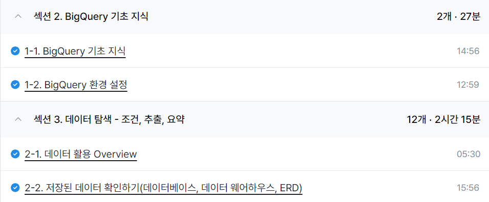

# Week1

## 1-1. BigQuery 기초 지식
- 데이터 저장 형태
    - Database: 데이터의 저장소
    - Table: 데이터가 저장된 공간
    - 저장된 데이터를 제품에서 사용
- OLTP
    - 거래를 하기 위해 사용되는 데이터베이스
    - 보류, 중간 상태가 없음  :  '데이터가 무결하다'
    - 데이터의 추가(INSERT), 데이터의 변경(UPDATE) 많이 발생
    - 분석을 위해 만든 것이 아니여서 쿼리 속도가 느릴 수 있음
- SQL(Structure Query Language)
    - DB에서 데이터를 가지고 올때 사용하는 언어
    - 행(row) -> 하나의 row가 하나의 고유한 데이터
    - 열(column) -> 각 데이터의 특성 속성 값
- OLAP(Online Analytical Processing)
    - 분석을 위한 기능 제공
- 데이터 웨어하우스(Data Warehouse)
    - 데이터를 한 곳에 모아서 저장
- BigQuery (OLAP + DW)
    - SQL로 데이터 추출 난이도 쉬움
    - 속도가 빠름
    - Firebase, Google Analytics 4의 데이터 쉽게 추출 가능
    - 데이터 웨어하우스를 쓰기 위해 서버(컴퓨터)를 띄울 필요 없음

## 1-2. BigQuery 환경 설정

- BigQuery의 환경 구성 요소
    1. 프로젝트(Project)
        - 하나의 큰 건물
        - 하나의 프로젝트에 여러 데이터셋이 존재할 수 있음
    2. 데이터셋(Dataset)
        - 프로젝트에 있는 창고
        - 판매 데이터, 고객 데이터 등 별도의 데이터를 저장할 수 있음
        - 하나의 데이터셋에 다양한 테이블이 존재할 수 있음
    3. 테이블(Table)
        - 창고에 있는 선반
        - 테이블 안에 상품의 세부 정보 저장
        - 테이블 안엔 행과 열로 이루어진 데이터들이 저장

## 2-1. 데이터 활용 Overview
- 데이터를 활용하는 과정
    1. 어떤 일을 해야 한다
    2. 원하는 것을 정한다
    3. 데이터 탐색
        
        -> 단일자료 / 다량의 자료
    - 다량의 자료 -> 조건/추출/변환/요약

    4. 데이터 결과 검증
    5. 피드백 / 활용

## 2-2. 저장된 데이터 확인하기

- 데이터가 저장되는 형태를 알려면?
    - ERD(Entity Relationship Diagram)
    : 데이터베이스 구조를 한눈에 알아보기 위해 사용
    - ERD가 없으면 모든 DB를 직접 보면서 탐색
        - 어떤 **테이블**이 존재하는가?
        - 어떤 **컬럼**이 존재하는가?
        - 다른 테이블과 **연결**할 때 어떤 컬럼을 사용하는가?
        - 컬럼의 값들은 **어떤 의미**를 가지는가?

- 회사에 존재할 수 있는 데이터(예시)
    1. 서비스에 사용될 데이터베이스
        - 유저 테이블
        - 배송 테이블
        - 물건 테이블
    2. 앱/웹 로그 데이터
        - 유저가 앱/웹에 들어와서 회원가입 - 페이지 확인, 컨텐츠 확인 등등
        - "과정"을 알 수 있는 데이터
    3. 공공 데이터, 서드파티(third-party) 데이터
        - 날씨
        - 페이스북 광고 데이터

- 포켓몬 세상의 데이터
    - 포켓몬
    - 트레이너
    - 트레이너가 잡은 포켓몬
    - 트레이너가 도전한 유저 배틀
    - 트레이너가 도전한 체육관 배틀
    - NPC
    - 상점
    - 상점 별 판매 상품
- 이커머스 산업의 데이터
    - 포켓몬: 상품
    - 트레이너: 유저
    - 트레이너가 잡은 포켓몬: 주문
    - 장바구니에 담은 물건
    - 웹페이지 접근 수
    - 웹페이지 버튼 클릭 수

    