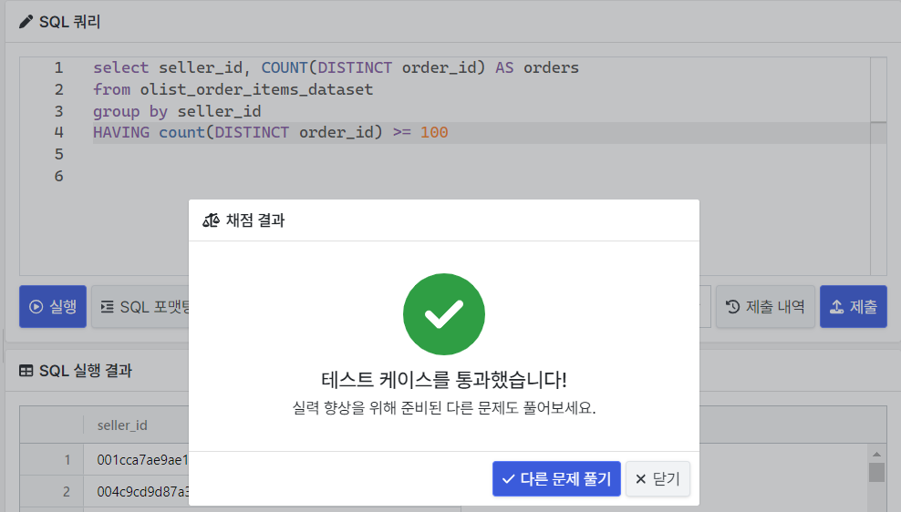
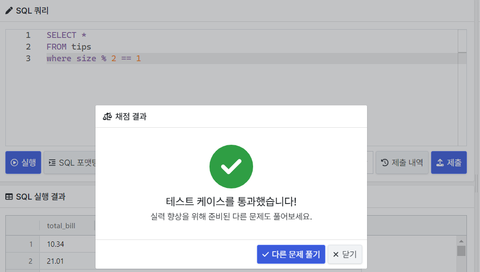
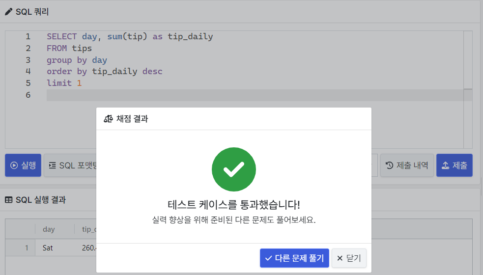

### 문제 1 : 우리 플랫폼에 정착한 판매자

```sql
SELECT SELLER_ID, COUNT(DISTINCT ORDER_ID) AS orders
FROM OLIST_ORDER_ITEMS_DATASET
GROUP BY SELLER_ID
HAVING COUNT(DISTINCT ORDER_ID) >= 100
```


총 주문이 100건 이상 들어온 판매자 리스트를 출력하는 문제여서 COUNT(ORDER_ID) >= 100 이라고 제출을 해서 오류가 발생했다.

-> ORDER_ID가 중복이 가능한 점을 놓쳐서 DISTINCT를 사용해서 수정하였다.




### 문제 2 : 몇 분이서 오셨어요?

```sql
SELECT *
FROM tips
WHERE size % 2 == 1
```

- 이 문제에서는 고객이 홀수 라는 것을 표현하는 것이 핵심
- 홀수를 표현하기 위해 2로 나눈 나머지가 1 이라는 식을 사용했다. 



where 절에서의 간단한 계산 문제  


### 문제 3 : 최고의 근무일을 찾아라

```sql
SELECT day, sum(tip) as tip_daily
FROM tips
group by day 
order by tip_daily desc
limit 1
```

- 요일별로 팁 총액을 집계 : day로 group by + sum(tip)으로 order by
- 그 다음 가장 큰 값만 출력하면 되는 문제이다.



  