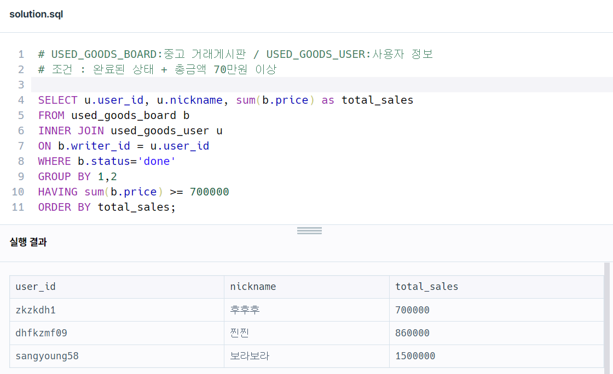
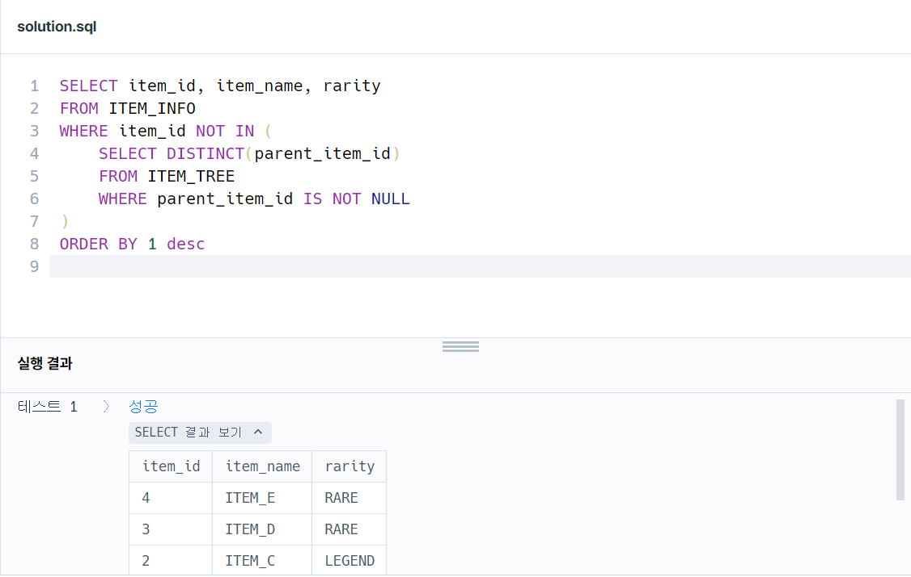
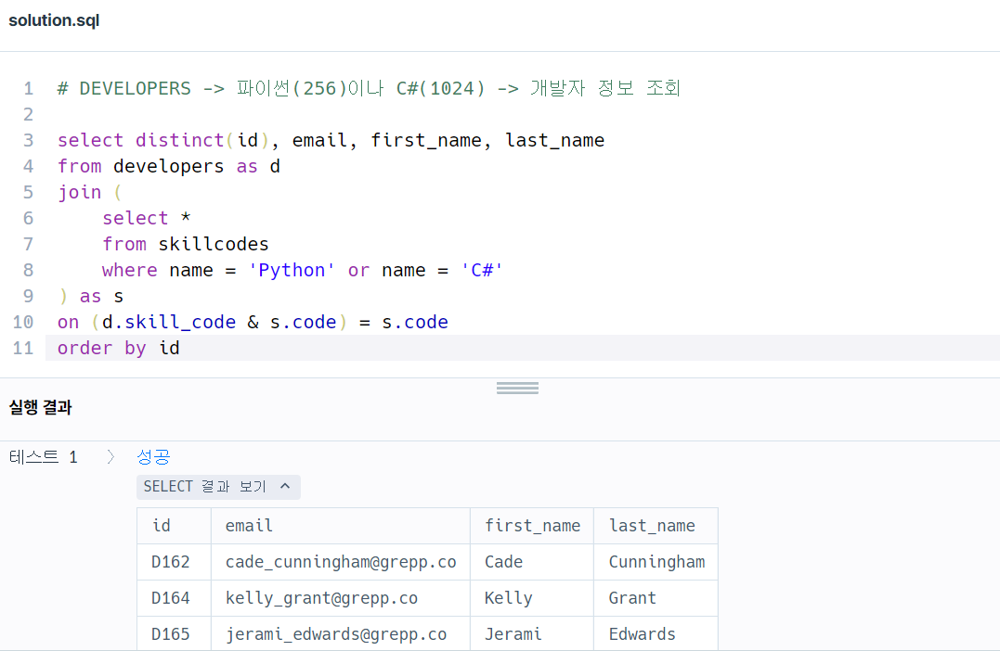

### 문제 1 : 조건에 맞는 사용자와 총 거래금액 조회하기

```sql
# 중고거래 게시판 정보 / 사용자 정보
# 완료된 중고거래 총금액 >= 700000

SELECT u.user_id, u.nickname, sum(b.price) as total_sales
FROM used_goods_board b
INNER JOIN used_goods_user u
ON b.writer_id = u.user_id
WHERE b.status='done'
GROUP BY 1,2
HAVING sum(b.price) >= 700000
ORDER BY total_sales;
```

- 문제 풀이 흐름
1. b.writer_id = u.user_id 으로 INNER JOIN 사용
2. 완료된 중고 거래이기 때문에 STATUS='DONE' 설정
3. user_id(첫 번째 컬럼)와 nickname(두 번째 컬럼)을 기준으로 데이터를 그룹화 진행
4. GROUP BY 한 후에 조건 설정해주기



### 문제 2 : 업그레이드 할 수 없는 아이템 구하기


```sql
# 각 아이템들은 오직 하나의 PARENT 아이템 ID 를 가진다
# ROOT 아이템의 PARENT 아이템 ID 는 NULL
# 더 이상 업그레이드할 수 없는 아이템 정보(ITEM_ID, ITEM_NAME, RARITY)를 출력

SELECT item_id, item_name, rarity
FROM ITEM_INFO
WHERE item_id NOT IN (
    SELECT DISTINCT(parent_item_id)
    FROM ITEM_TREE
    WHERE parent_item_id IS NOT NULL
)
ORDER BY 1 desc
```

- 따로 공부한 내용 정리

IN에 대해 살펴보면, IN은 뒤따라 주어지는 값들 중 하나라도 == 비교를 만족하면 해당 데이터를 출력한다. →  OR 연산과 같음

그러나, NOT IN은 뒤따라 주어지는 값들 모두에 대해 != 비교를 만족해야 해당 데이터를 출력 → **AND 연산**과 같음

예를 들어, NOT IN (1, 2, NULL) 일 경우 데이터가 출력되려면 1도 아니고 2도 아니고 NULL도 아니어야 한다는 뜻

여기서 추가질문)

"item_id NOT IN (1, 2, NULL) 일 경우, item_id가 3이면 해당 데이터는 출력되어야 하는 것이 아니냐" →  **NULL과의 비교는 무조건 false이다.**

따라서 3은 1도 아니고 2도 아니고 NULL도 아니라고 할지라도 3과 NULL의 비교 결과값이 false 이기 때문에 NOT IN의 AND 연산에서 결과적으로 false가 되어 아무런 데이터도 반환되지 못하게 된다.




### 문제 3 : 조건에 맞는 개발자 찾기


```sql
# DEVELOPERS -> 파이썬(256)이나 C#(1024) -> 개발자 정보 조회

select distinct(id), email, first_name, last_name
from developers as d 
join (
    select *
    from skillcodes
    where name = 'Python' or name = 'C#'
) as s
on (d.skill_code & s.code) = s.code
order by 1
```

- 쿼리 정리
1. JOIN 구문에 서브쿼리를 사용하여 스킬 이름이 파이썬이거나 C#인 경우만 추출
2. 비트 연산: d.skill_code & s.code
    - developers 테이블의 skill_code와 skillcodes 테이블의 code 사이에 비트 AND 연산을 수행하여, 개발자가 가진 스킬 코드와 Python 또는 C# 코드가 일치하는지 확인

각각 파이썬, C# 스킬을 보유한 경우 말고도 두가지 스킬 모두 가지는 경우를 구현하는데 시간이 좀 걸렸다.


