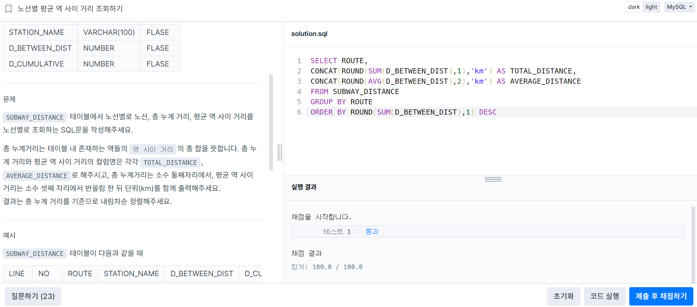

### 문제 1 : [JOIN] ROOT 아이템 구하기

```sql
SELECT I.ITEM_ID, I.ITEM_NAME
FROM ITEM_INFO as I
JOIN ITEM_TREE as T
ON T.ITEM_ID = I.ITEM_ID
WHERE T.PARENT_ITEM_ID IS NULL
ORDER BY ITEM_ID

```
풀이 흐름
- ROOT 아이템의 PARENT 아이템 ID는 NULL이라는 특징을 사용하면 되는 문제
- 조인 ~ Root item의 조건 ~ 정렬 순서로 풀이


### 문제 2 : [CONCAT 사용] 노선별 평균 역 사이 거리 조회하기

```sql
SELECT ROUTE,
CONCAT(ROUND(SUM(D_BETWEEN_DIST),1),'km') AS TOTAL_DISTANCE,
CONCAT(ROUND(AVG(D_BETWEEN_DIST),2),'km') AS AVERAGE_DISTANCE
FROM SUBWAY_DISTANCE
GROUP BY ROUTE
ORDER BY ROUND(SUM(D_BETWEEN_DIST),1) DESC
```
풀이 흐름
- 문제에서 "소수 셋째 자리에서 반올림 한 뒤 단위(km)"이런 식으로 표현하도록 하여 이를 구현하기 위해 CONCAT 사용함
- 처음 제출 때 ORDER BY TOTAL_DISTANCE를 해서 오류가 발생했는데 내림차순 정렬을 해야하기 때문에 'KM'를 빼줘야 함




### 문제 3 : 헤비 유저가 소유한 장소

- 윈도우 함수 사용

```sql
WITH 헤비유저 AS (SELECT HOST_ID 
                    FROM PLACES
                    GROUP BY HOST_ID
                    HAVING COUNT(*)>=2)
                    
SELECT P.ID,P.NAME,P.HOST_ID 
FROM   PLACES AS P
JOIN   헤비유저 AS H
ON     H.HOST_ID = P.HOST_ID
ORDER BY P.ID
```

- 서브쿼리 사용 코드

```sql
SELECT id, name, host_id
FROM places
WHERE host_id 
IN (
    SELECT host_id
    FROM places
    GROUP BY host_id
    HAVING COUNT(*) >= 2
)
ORDER BY id;
```
풀이 흐름
- 2가지 방법으로 풀어봤는데 첫번째는 윈도우 함수 WITH절을 사용하였고 두번째는 서브쿼리를 활용했다.
- 풀이 구조는 HOST_ID가 2개 이상인 사람만 따로 추출해서 사용하는 식으로 비슷한 구조이다.
- 이 문제에서는 서브쿼리를 이용한 코드가 더 쉽다고 느꼈는데 문제가 복잡해지먼 WITH절을 활용하면 좋을 것 같다고 생각했다.


