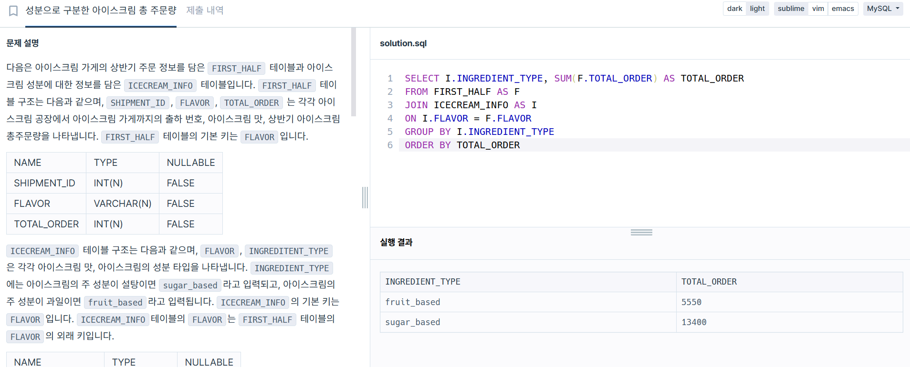

### 1. [JOIN] 성분으로 구분한 아이스크림 총 주문량

```sql
SELECT I.INGREDIENT_TYPE, SUM(F.TOTAL_ORDER) AS TOTAL_ORDER
FROM FIRST_HALF AS F
JOIN ICECREAM_INFO AS I
ON I.FLAVOR = F.FLAVOR
GROUP BY I.INGREDIENT_TYPE
ORDER BY TOTAL_ORDER

```
풀이 흐름
- FIRST_HALF와 ICECREAM_INF 테이블을 기준으로 조인하는 문제
- 총주문량을 TOTAL_ORDER 설정하고 이 기준으로 order by




### 2. [MAX] 즐겨찾기가 가장 많은 식당 정보 출력하기
```sql
SELECT FOOD_TYPE, REST_ID, REST_NAME, FAVORITES
FROM REST_INFO
WHERE (FOOD_TYPE,FAVORITES) 
IN 
(
    SELECT FOOD_TYPE, MAX(FAVORITES) 
    FROM REST_INFO
    GROUP BY FOOD_TYPE
)
ORDER BY FOOD_TYPE DESC;

```
풀이 흐름
- 메인 쿼리의 WHERE 조건: (FOOD_TYPE, FAVORITES)가 서브쿼리의 결과에 포함된 값들만 불러옴
- 서브쿼리로 음식 종류와 즐겨찾기 수가 가장 많은 값을 구함


### 3. [WINDOW] 조건에 맞는 사원 정보 조회하기
```sql
SELECT SUM(B.SCORE) as SCORE, A.EMP_NO, A.EMP_NAME, A.POSITION, A.EMAIL
FROM HR_EMPLOYEES A
JOIN HR_GRADE B ON A.EMP_NO = B.EMP_NO
WHERE B.YEAR = 2022
GROUP BY B.EMP_NO
ORDER BY SCORE desc
LIMIT 1;

```
풀이 흐름
- EMP_NO 기준으로 조인 + where조건으로 2022년 필터링
- SUM으로 상,하반기 점수의 합 계산

