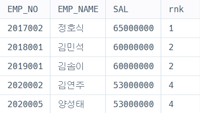
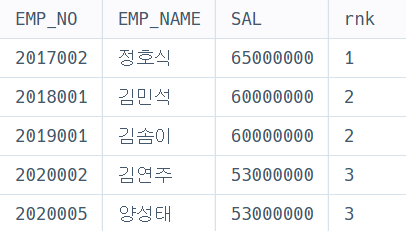
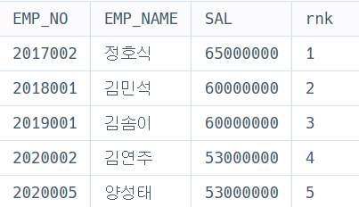

## 틀린 코드 이유 분석(정답 코드 참고)

**틀린 코드**

```sql
SELECT *
FROM SELECT FOOD_TYPE, REST_ID, REST_NAME, MAX(FAVORITES) AS FAVORITES
FROM REST_INFO
GROUP BY FOOD_TYPE
ORDER BY FOOD_TYPE DESC
```

**틀린 이유**
```
- 오답 코드에서는  GROUP BY FOOD_TYPE을 사용했기 때문에 FOOD_TYPE 외의 REST_ID, REST_NAME은 적용되지 않는다.
- 음식종류별로 즐겨찾기수가 가장 많은 식당을 구현하기 위해 MAX(FAVORITES)를 사용했는데 오답 코드에서는 각 FOOD_TYPE별로
즐겨찾기 수의 최대값만 반환한다. REST_ID와 REST_NAME는 적용되지 않기 때문에 서브쿼리 순서를 바꿔줘야 한다.
```

**정답 코드**
```sql
    SELECT FOOD_TYPE, REST_ID, REST_NAME, FAVORITES
    FROM REST_INFO
    WHERE (FOOD_TYPE, FAVORITES) IN (
        SELECT FOOD_TYPE, MAX(FAVORITES)    
        FROM REST_INFO
        GROUP BY FOOD_TYPE
    ) 
    ORDER BY FOOD_TYPE DESC;
```


## 개선된 쿼리 학습

또한, 이 문제에서는 아래 **개선된 쿼리**로도 조회될 수 있습니다. 

**ROW_NUMBER 윈도우 함수**를 사용합니다.
### 성분으로 구분한 아이스크림 총 주문량

```sql
WITH RankedRest AS (                        -- WITH 절 사용
    SELECT 
        FOOD_TYPE,              
        REST_ID,               
        REST_NAME,              
        FAVORITES,              
        ROW_NUMBER() OVER (                  -- ROW_NUMBER 윈도우 함수 사용
            PARTITION BY FOOD_TYPE           -- 음식 종류별로 그룹화
            ORDER BY FAVORITES DESC, REST_ID -- 즐겨찾기 수 내림차순, 동점일 경우 REST_ID 오름차순 정렬
        ) AS rnk                     
    FROM REST_INFO
)
SELECT 
    FOOD_TYPE,                  
    REST_ID,                    
    REST_NAME,                  
    FAVORITES                   
FROM RankedRest
WHERE rnk = 1                   
ORDER BY FOOD_TYPE DESC; 
```

- 성능 이점) 기존 서브쿼리 방식은 MAX(FAVORITES)를 계산하기 위해 추가로 데이터를 그룹화 및 비교해야 하므로, 데이터가 클 경우 성능 차이가 날 수 있다.
- 기존 코드에서는 서브쿼리로 MAX(FAVORITES)를 구하고, 이를 메인 쿼리에서 비교해야 했는데, 개선된 코드는 윈도우 함수를 사용해 한 번의 연산으로 순위를 계산하며, 서브쿼리를 사용하지 않아 코드를 단순화할 수 있다.
- 중복값을 더 잘 처리할 수 있다.


## 2.조건에 맞는 사원 정보 조회하기

<!--지시사항을 따르고 <코드 실행>을 누르면 물론 ‘실패’로 뜰 겁니다. 다만 그 때 ‘SELECT 결과보기’를 눌러 세부 사항을 확인해주세요-->

**기본 코드**

```sql
SELECT
    EMP_NO,
    EMP_NAME,
    SAL,
    RANK() OVER (ORDER BY SAL DESC) AS rnk
FROM
    HR_EMPLOYEES;
```

이때, **RANK(), DENSE_RANK(), ROW_NUMBER() 함수**를 사용하며 결과를 비교하고 해당 함수를 사용하는 경우를 서술해주세요. (함수 사용 예제는 직접 찾아보기)

- **RANK()**
    ```
    RANK 함수는 동일한 값에는 동일한 순위가 출력되지만, 만약 중복된 값일 경우 그 다음은  순위를 건너뛴다.
    1 -> 2 -> 2 -> 4
    EX) 여러 팀들에 대한 경기 순위 책정
    ```
    


- **DENSE_RANK()**
    ```
    DENSE_RANK 함수는 동일한 값에는 동일한 순위를 출력하지만, 다음 순위는 건너뛰지 않는다. 이 점이 RANK함수와의 차이점이다.

    ```
    

- **ROW_NUMBER()**
    ```
    ROW_NUMBER 함수는 동일한 값이 있어도 중복하지 않는다. 중복값이 존재해도 순차적으로 순위를 정하고 싶을 때 활용
    TOP N개의 순위를 뽑고 싶을 경우
    ```
    


